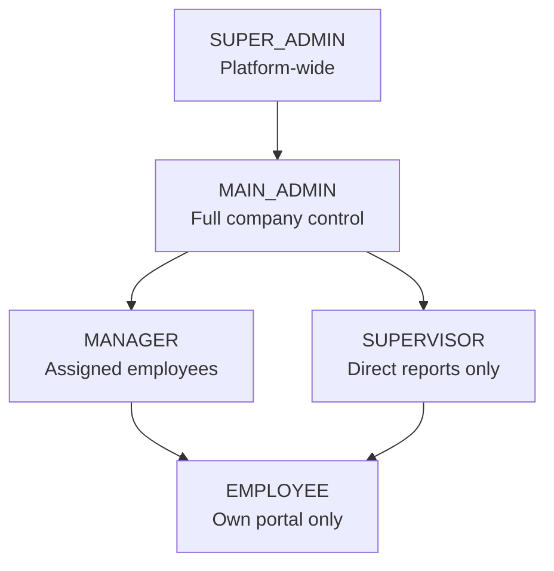
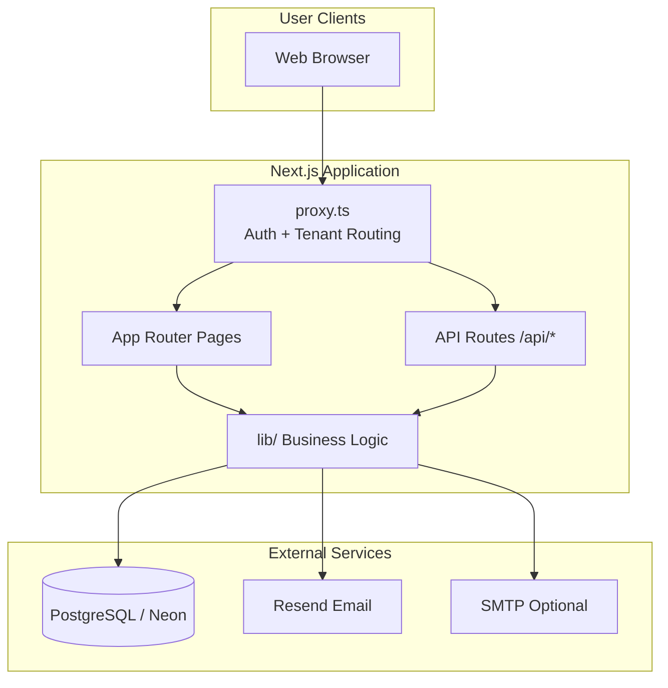
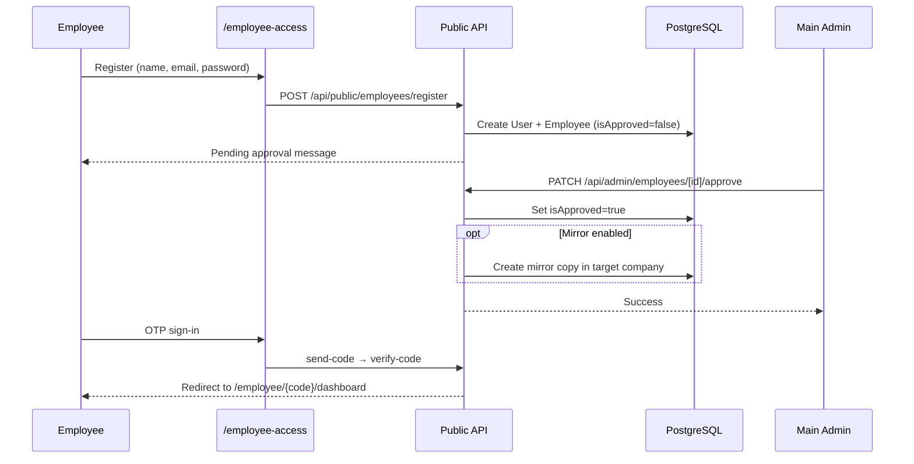
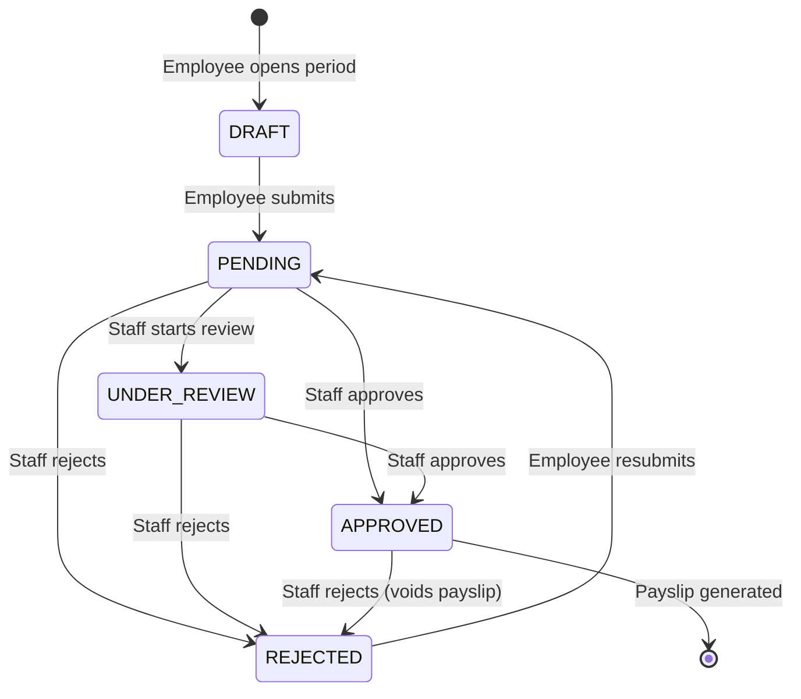
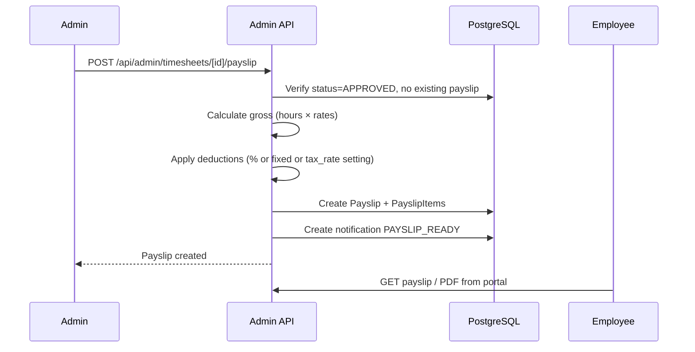
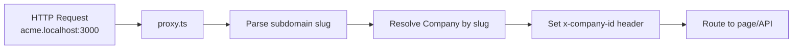
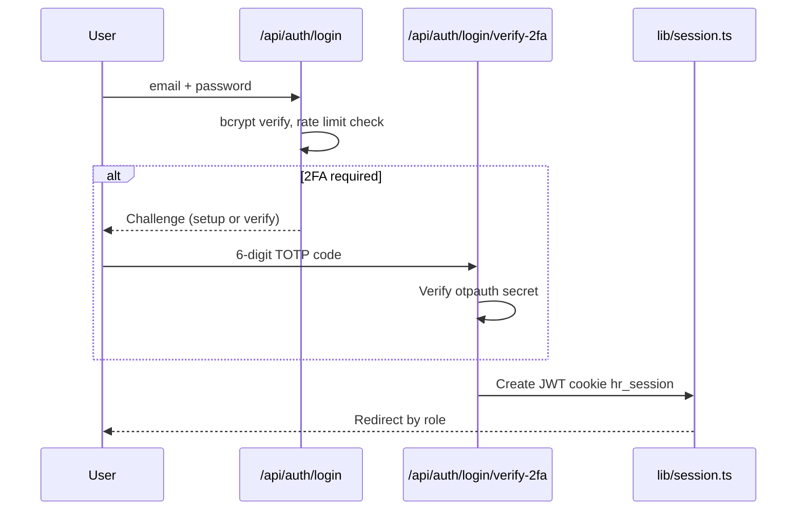
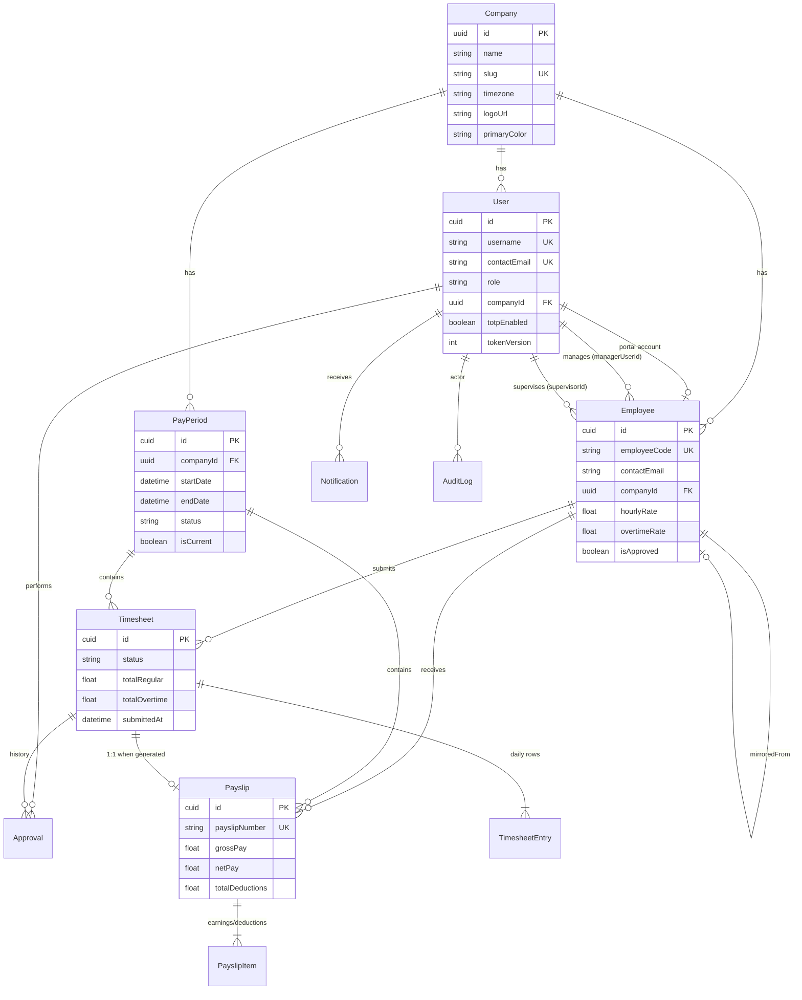

# PayRun — Complete Project Handoff Documentation

**Product name:** PayRun (package: `payrun`)  
**Repository:** [Payroll-Manager](https://github.com/syal00/Payroll-Manager.git)  
**Purpose:** Multi-tenant SaaS for employee hours tracking, timesheet approval, and payslip generation.

This document is written for anyone receiving the project — developers, operators, or stakeholders — and covers setup, architecture, roles, use cases, flow diagrams, database schema, APIs, deployment, and maintenance.

---

## Table of Contents

1. [Executive Summary](#1-executive-summary)
2. [Tech Stack](#2-tech-stack)
3. [Installation & Setup](#3-installation--setup)
4. [Environment Variables](#4-environment-variables)
5. [Project Structure](#5-project-structure)
6. [User Roles & Permissions](#6-user-roles--permissions)
7. [Application Portals & Routes](#7-application-portals--routes)
8. [Use Cases](#8-use-cases)
9. [Flow Diagrams](#9-flow-diagrams)
10. [Database Schema](#10-database-schema)
11. [Business Rules & Payroll Logic](#11-business-rules--payroll-logic)
12. [Multi-Tenant Architecture](#12-multi-tenant-architecture)
13. [Authentication & Security](#13-authentication--security)
14. [API Reference (Summary)](#14-api-reference-summary)
15. [Email & Notifications](#15-email--notifications)
16. [Scripts & Maintenance](#16-scripts--maintenance)
17. [Deployment](#17-deployment)
18. [Demo Data & Test Accounts](#18-demo-data--test-accounts)
19. [Troubleshooting](#19-troubleshooting)
20. [Known Limitations](#20-known-limitations)

---

## 1. Executive Summary

PayRun is a payroll hours management system with three main user experiences:

| Portal | Who | URL pattern |
|--------|-----|-------------|
| **Marketing site** | Public visitors | `/`, `/features`, `/contact`, etc. |
| **Admin portal** | Main admin, managers, supervisors | `/admin/*`, sign in at `/login` |
| **Employee portal** | Employees | `/employee-access`, then `/employee/{code}/*` |
| **Super admin** | Platform operator | `/super-admin/*` |

**Core workflow:**

1. Admin creates pay periods and employees (or employees self-register).
2. Employees enter daily hours on timesheets for open pay periods.
3. Employees submit timesheets → managers/admins review and approve/reject.
4. Admin generates payslips from approved timesheets.
5. Employees view/download payslips in their portal.

Data is isolated per **Company** (tenant). A super admin can create companies, provision staff, and inspect any tenant.

---

## 2. Tech Stack

| Layer | Technology |
|-------|------------|
| Framework | Next.js 16 (App Router) |
| UI | React 19, Tailwind CSS 4, Framer Motion, Lucide icons |
| Database | PostgreSQL (Neon recommended) |
| ORM | Prisma 5 |
| Auth | bcrypt (passwords), jose (JWT sessions), TOTP 2FA (otpauth) |
| Email | Resend (primary) or Nodemailer/SMTP |
| PDF | @react-pdf/renderer |
| Validation | Zod |
| Charts | Recharts |

**Important:** This project uses Next.js 16 conventions including root `proxy.ts` for request routing/auth (not classic `middleware.ts`). Read `node_modules/next/dist/docs/` before changing routing.

---

## 3. Installation & Setup

### Prerequisites

- Node.js 18+ (20+ recommended)
- npm
- PostgreSQL database (Neon free tier works)
- Optional: Resend account for email (OTP, welcome emails, payslip notifications)

### Step-by-step (local development)

```bash
# 1. Clone and install
git clone https://github.com/syal00/Payroll-Manager.git
cd Payroll-Manager
npm install

# 2. Configure environment
cp .env.example .env
# Edit .env — set DATABASE_URL, DIRECT_URL, AUTH_SECRET (see section 4)

# 3. Database + demo data
npm run setup
# Runs: prisma generate → prisma migrate deploy → prisma/seed.ts

# 4. Start dev server
npm run dev
# Opens http://localhost:3000
```

**Interactive checklist:** Open `setup.html` in a browser (no server needed) for a guided local setup with copy buttons.

### npm Scripts

| Command | Description |
|---------|-------------|
| `npm run dev` | Validates `.env`, starts Next.js dev server |
| `npm run build` | Generate Prisma client, run migrations, ensure demo admins, production build |
| `npm run start` | Production server (prints LAN URLs via `scripts/start-lan.mjs`) |
| `npm run setup` | `prisma generate` + `migrate deploy` + full seed |
| `npm run db:migrate` | Apply migrations only |
| `npm run db:seed` | Run seed script only |
| `npm run db:generate` | Regenerate Prisma client after schema changes |
| `npm run db:studio` | Open Prisma Studio (visual DB browser) |
| `npm run lint` | ESLint |

---

## 4. Environment Variables

### Required

| Variable | Purpose |
|----------|---------|
| `DATABASE_URL` | Pooled PostgreSQL URL (Neon `*-pooler` host). Used at runtime. |
| `DIRECT_URL` | Direct PostgreSQL URL (no `-pooler`). Used by Prisma migrations. |
| `AUTH_SECRET` | JWT signing secret. **Minimum 32 characters.** |

Generate `AUTH_SECRET`:

```bash
node -e "console.log(require('crypto').randomBytes(32).toString('base64'))"
```

### Routing & Branding

| Variable | Purpose | Example |
|----------|---------|---------|
| `ROOT_DOMAIN` | Apex hostname for tenant subdomain parsing (no port) | `localhost` (dev), `payrun.app` (prod) |
| `NEXT_PUBLIC_APP_DOMAIN` | Display suffix for tenant URLs in UI | `localhost:3000`, `payrun.app` |
| `NEXT_PUBLIC_COMPANY_NAME` | Default product name in UI | `PayRun` |
| `NEXT_PUBLIC_STAFF_SIGN_IN_URL` | Link in staff welcome emails | `https://your-app.vercel.app/login` |

### Company Mirror (optional demo feature)

| Variable | Purpose |
|----------|---------|
| `COMPANY_MIRROR_SOURCE_SLUG` | Source tenant slug | `syal-operations` |
| `COMPANY_MIRROR_TARGET_SLUG` | Target tenant slug | `unison-security` |
| `COMPANY_MIRROR_ENABLED` | `true` / `false` — sync employees & pay periods across companies |

When enabled, creating employees or pay periods in the source company automatically mirrors them to the target company.

### Email (pick Resend OR SMTP)

**Resend (recommended):**

| Variable | Purpose |
|----------|---------|
| `RESEND_API_KEY` | API key from resend.com |
| `MAIL_FROM` | Sender for tenant emails, e.g. `PayRun <onboarding@resend.dev>` |
| `PLATFORM_MAIL_FROM` | Sender for super-admin platform emails |

**SMTP alternative (Gmail, etc.):**

| Variable | Purpose |
|----------|---------|
| `SMTP_HOST`, `SMTP_PORT`, `SMTP_SECURE` | SMTP server settings |
| `SMTP_USER`, `SMTP_PASS`, `SMTP_FROM` | Credentials and from address |

**Note:** Without email configured, employee OTP codes may appear on-screen in development (`devOtp` in API response). `scripts/check-env.mjs` warns if no email provider is set.

---

## 5. Project Structure

```
payroll manager/
├── app/                      # Next.js App Router
│   ├── (marketing)/          # Public landing pages
│   ├── admin/                # Admin portal pages
│   ├── employee/             # Employee portal pages
│   ├── employee-access/      # Employee login/register hub
│   ├── super-admin/          # Platform operator pages
│   ├── api/                  # REST API routes (75 handlers)
│   └── login/                # Staff sign-in
├── components/               # React UI (admin, employee, landing, shells)
├── lib/                      # Business logic, auth, email, payroll math
├── prisma/
│   ├── schema.prisma         # Database schema
│   ├── migrations/           # SQL migrations
│   └── seed.ts               # Demo data seed
├── public/                   # Static assets (logos, uploads)
├── scripts/                  # CLI utilities (env check, demo admins, mirror tools)
├── docs/                     # Documentation (this file)
├── proxy.ts                  # Next.js 16 request proxy (auth + multi-tenant routing)
├── next.config.ts
├── vercel.json               # Vercel build/deploy config
├── setup.html                # Browser-based setup checklist
└── README.md                 # Quick start
```

### Key `lib/` modules

| Module | Purpose |
|--------|---------|
| `lib/session.ts` | JWT session cookie (`hr_session`) |
| `lib/api-auth.ts` | Route guards (`requireStaff`, `requireMainAdmin`, etc.) |
| `lib/roles.ts` | Role normalization and redirect paths |
| `lib/manager-scope.ts` | Which employees/timesheets each staff role can see |
| `lib/pay-period-company.ts` | Pay period CRUD, cascade delete |
| `lib/pay-period-utils.ts` | UTC date handling, flexible pay period windows |
| `lib/timesheet-period-entries.ts` | Auto-create/sync timesheet rows for period days |
| `lib/payslip-profile.ts` | Gross pay calculation from rates and hours |
| `lib/deduction-percent.ts` | Percentage-based deductions (0–100%) |
| `lib/pay-rates.ts` | Hourly/overtime rate validation (0–100) |
| `lib/company-mirror.ts` | Cross-company employee/period mirroring |
| `lib/tenant-acting.ts` | Super-admin "act as tenant" cookie |
| `lib/mailer.ts` | Send email via Resend or SMTP |

---

## 6. User Roles & Permissions

### Role hierarchy



### Role matrix

| Capability | SUPER_ADMIN | MAIN_ADMIN | MANAGER | SUPERVISOR | EMPLOYEE |
|------------|:-----------:|:----------:|:-------:|:----------:|:--------:|
| Create/manage companies | ✓ | — | — | — | — |
| Company settings / tax rate | — | ✓ | — | — | — |
| Create pay periods | — | ✓ | ✓ | ✓ | — |
| Create/delete employees | — | ✓ | — | — | — |
| Approve pending registrations | — | ✓ | — | — | — |
| Create manager accounts | — | ✓ | — | — | — |
| View all company employees | ✓* | ✓ | Partial† | Partial‡ | Own only |
| Review/approve timesheets | ✓* | ✓ | Partial† | Partial‡ | — |
| Generate payslips | ✓* | ✓ | ✓ | ✓ | — |
| Enter/submit timesheets | — | — | — | — | ✓ |
| View own payslips | — | — | — | — | ✓ |

\* Super admin accesses tenant data via drill-down or "tenant acting" cookie, not globally mixed.  
† Manager sees employees assigned to them **or** with no manager assigned.  
‡ Supervisor sees only employees where `supervisorId` matches their user ID.

### Legacy note

Database role `ADMIN` is migrated to `MAIN_ADMIN`. JWT may still contain `ADMIN`; `lib/roles.ts` normalizes it.

---

## 7. Application Portals & Routes

### Marketing (public)

| Route | Description |
|-------|-------------|
| `/` | Landing page |
| `/features` | Product features |
| `/how-it-works` | Process overview |
| `/about`, `/owner` | Company/owner info |
| `/contact`, `/faq` | Contact and FAQ |
| `/documentation` | In-app documentation page |
| `/demo-request` | Demo request form |
| `/employee-portal`, `/admin-access` | Portal info pages |
| `/privacy`, `/terms` | Legal pages |
| `/company-not-found` | Unknown tenant subdomain |

### Staff sign-in

| Route | Description |
|-------|-------------|
| `/login` | Primary staff login (password + 2FA) |
| `/admin/login` | Alternate admin login (same form) |
| `/admin/change-password` | Forced password change after provisioning |

### Admin portal (`/admin/*`)

Requires staff session (MAIN_ADMIN, MANAGER, or SUPERVISOR).

| Route | Description | Main admin only? |
|-------|-------------|:----------------:|
| `/admin` | Dashboard | |
| `/admin/employees` | Employee roster | |
| `/admin/employees/[id]` | Employee detail, pay rates | |
| `/admin/pending-approval` | Pending self-registrations | |
| `/admin/pay-periods` | Create/manage pay periods | |
| `/admin/pay-periods/[id]` | Pay period detail | |
| `/admin/timesheets` | Timesheet list | |
| `/admin/timesheets/[id]` | Review, edit, generate payslip | |
| `/admin/payslips` | Payslip list | |
| `/admin/payslips/[id]` | Payslip detail, PDF, email | |
| `/admin/review` | Review queue | |
| `/admin/history` | Payroll history by period | |
| `/admin/reports` | Reports and audit snippets | |
| `/admin/managers` | Staff account management | ✓ |
| `/admin/settings` | Tax/deduction defaults | ✓ |
| `/admin/audit` | Audit log | |
| `/admin/profile` | Admin profile | |
| `/admin/demo-requests` | Marketing demo leads | |

### Employee portal

| Route | Description |
|-------|-------------|
| `/employee-access` | Hub: register or sign in |
| `/employee-access/register` | Self-service registration |
| `/employee-access/existing` | OTP sign-in for existing employees |
| `/employee/[employeeId]/dashboard` | Employee dashboard |
| `/employee/[employeeId]/timesheet` | Timesheet list |
| `/employee/[employeeId]/timesheet/[payPeriodId]` | Daily hour entry |
| `/employee/[employeeId]/payslips` | Payslip list |
| `/employee/[employeeId]/payslips/[payslipId]` | Payslip detail + PDF |
| `/employee/[employeeId]/history` | Past timesheets/payslips |
| `/employee/[employeeId]/profile` | Profile view |

**Access model:** Employee routes are "public" at the proxy level. Access is gated by knowing the `employeeCode` and having `isApproved: true`. OTP or password login confirms identity.

### Super admin (`/super-admin/*`)

Requires `SUPER_ADMIN` role.

| Route | Description |
|-------|-------------|
| `/super-admin/companies` | List/create companies |
| `/super-admin/usage` | Platform usage stats |
| `/super-admin/companies/[companyId]/dashboard` | Tenant overview |
| `/super-admin/companies/[companyId]/staff` | Staff accounts |
| `/super-admin/companies/[companyId]/employees` | Employees |
| `/super-admin/companies/[companyId]/timesheets` | Timesheets |
| `/super-admin/companies/[companyId]/payslips` | Payslips |

From company drill-down, **Admin console** sets a tenant-acting cookie and opens `/admin` as that company.

---

## 8. Use Cases

### UC-1: Super admin provisions a new company

**Actor:** Super admin  
**Precondition:** Super admin account exists  
**Flow:**

1. Sign in at `/login` → redirected to `/super-admin/companies`.
2. Click create company → enter name, slug, timezone, branding.
3. System creates Company, initial MAIN_ADMIN staff account, welcome email, and first bi-weekly pay period.
4. Super admin can open tenant drill-down or "Admin console" to manage the company.

**Postcondition:** New tenant is live at `{slug}.{ROOT_DOMAIN}`.

---

### UC-2: Main admin creates an employee

**Actor:** Main admin  
**Flow:**

1. Navigate to `/admin/employees` → Add employee.
2. Enter name, contact email, department, job title, hourly/overtime rates, optional manager/supervisor.
3. System creates Employee record with `isApproved: true` (no password yet).
4. Employee receives instructions to sign in via `/employee-access` (OTP or self-registration to set password).

**Alternative:** Employee self-registers (UC-3).

---

### UC-3: Employee self-registration

**Actor:** Prospective employee  
**Flow:**

1. Visit `/employee-access/register` (on correct tenant subdomain or default company).
2. Fill registration form: name, email, password, department, etc.
3. System creates User + Employee with `isApproved: false`.
4. Employee sees "pending approval" message.
5. Main admin approves at `/admin/pending-approval`.
6. Employee can now sign in and use the portal.

**Postcondition:** If company mirror is enabled, a copy is created in the target company.

---

### UC-4: Employee enters and submits a timesheet

**Actor:** Employee  
**Precondition:** Open pay period exists; employee is approved  
**Flow:**

1. Sign in via OTP at `/employee-access/existing` → redirected to `/employee/{code}/dashboard`.
2. Open current pay period timesheet.
3. System auto-creates one row per calendar day in the period (DRAFT status).
4. Employee enters regular, overtime, and leave hours per day.
5. Click Submit → status changes to `PENDING`.
6. Admin/manager receives notification.

**Validation rules:**

- Pay period must be `OPEN`.
- Total hours must be > 0.
- No future dates; 90-day lookback limit.
- Daily hour limits enforced by `lib/timesheet-math.ts`.

---

### UC-5: Manager reviews and approves a timesheet

**Actor:** Manager or main admin  
**Flow:**

1. Open `/admin/timesheets` or `/admin/review`.
2. Select a `PENDING` timesheet.
3. Optionally move to `UNDER_REVIEW`, add comment.
4. Approve → status `APPROVED`, employee notified.
5. Or Reject → status `REJECTED` with reason; employee can edit and resubmit.

**Note:** Rejecting an already-approved timesheet voids any existing payslip.

---

### UC-6: Admin generates a payslip

**Actor:** Staff (main admin, manager, supervisor with scope)  
**Precondition:** Timesheet status = `APPROVED`; no existing payslip; regular + overtime hours > 0  
**Flow:**

1. Open timesheet detail at `/admin/timesheets/[id]`.
2. Click Generate Payslip.
3. Optionally override hourly/overtime rates or set deduction percentage (0–100%).
4. System calculates gross pay, applies deductions (custom items, percentage, or default tax rate from settings).
5. Creates Payslip + PayslipItem rows; snapshots job title and department.
6. Employee notified (`PAYSLIP_READY`).

**Follow-up:** Mark sent, email PDF, or employee downloads from portal.

---

### UC-7: Admin manages pay periods

**Actor:** Staff  
**Flow:**

1. Navigate to `/admin/pay-periods`.
2. Create new period: name (optional), start date, end date (any length — not fixed to 14 days).
3. Set as current, or close period (`CLOSED` / `PROCESSING`).
4. Closed periods block new timesheet creation/editing.
5. Delete period (with confirmation) — cascades timesheets, payslips, approvals.

**Default:** New companies get an initial bi-weekly period via provisioning.

---

### UC-8: Staff login with 2FA

**Actor:** Admin, manager, supervisor, or super admin  
**Flow:**

1. Go to `/login`, enter contact email/username + password.
2. If TOTP not yet set up → QR code shown; scan with authenticator app, verify code.
3. If TOTP enabled → enter 6-digit code from authenticator.
4. Session cookie set (`hr_session`, 7 days).
5. Redirect based on role (super admin → companies list; staff → admin dashboard).

**Bypass:** Demo/test accounts in `lib/test-account-bypass-2fa.ts` skip 2FA.

---

## 9. Flow Diagrams

### System architecture



### Employee registration & approval



### Timesheet lifecycle



### Payslip generation



### Multi-tenant request routing



### Staff authentication



---

## 10. Database Schema

### Entity Relationship Diagram



### Models reference

#### Company
Tenant root. All payroll data is scoped by `companyId`.

| Field | Type | Notes |
|-------|------|-------|
| `id` | UUID | Primary key |
| `name` | String | Display name |
| `slug` | String | Unique subdomain identifier |
| `timezone` | String | IANA timezone (default `America/Toronto`) |
| `logoUrl`, `primaryColor`, `websiteUrl` | Optional | Branding |

#### User
Staff and employee login accounts.

| Field | Type | Notes |
|-------|------|-------|
| `username` | String | Unique login handle |
| `contactEmail` | String | Unique contact email |
| `role` | String | SUPER_ADMIN, MAIN_ADMIN, MANAGER, SUPERVISOR, EMPLOYEE |
| `companyId` | UUID? | Null only for SUPER_ADMIN |
| `passwordHash` | String | bcrypt |
| `tokenVersion` | Int | Incremented on logout to invalidate sessions |
| `mustChangePassword` | Boolean | Force change on next login |
| `totpSecretEnc`, `totpEnabled` | | TOTP 2FA for staff |
| `deletedAt` | DateTime? | Soft-delete / suspension |

#### Employee
Payroll profile linked to a company (and optionally a User for portal login).

| Field | Type | Notes |
|-------|------|-------|
| `employeeCode` | String | Globally unique portal ID (e.g. `EMP-XXXX`) |
| `contactEmail`, `username` | String | Unique per `(companyId, ...)` |
| `hourlyRate`, `overtimeRate` | Float | Default 28 / 42; admin can set 0–100 |
| `isApproved` | Boolean | Must be true for portal access |
| `emailVerified` | Boolean | Set after OTP verification |
| `managerUserId`, `supervisorId` | FK → User | Assignment for scope filtering |
| `mirroredFromEmployeeId` | FK → Employee | Link to source if mirrored |
| `deletedAt` | DateTime? | Soft-delete (archive) |

#### PayPeriod
Date window for timesheet entry. Scoped per company.

| Field | Type | Notes |
|-------|------|-------|
| `startDate`, `endDate` | DateTime | Flexible length (any valid window) |
| `status` | String | OPEN, CLOSED, PROCESSING |
| `isCurrent` | Boolean | One current period per company |
| Unique | | `(companyId, startDate, endDate)` |

#### Timesheet
One per employee per pay period.

| Field | Type | Notes |
|-------|------|-------|
| `status` | String | DRAFT → PENDING → UNDER_REVIEW → APPROVED / REJECTED |
| `totalRegular`, `totalOvertime`, `totalLeave`, `totalHours` | Float | Computed from entries |
| `submittedAt` | DateTime? | Set on submit |

#### TimesheetEntry
Daily hour breakdown. One row per calendar day in the period.

| Field | Type | Notes |
|-------|------|-------|
| `workDate` | DateTime | UTC calendar day |
| `regularHours`, `overtimeHours`, `leaveHours` | Float | |
| `location`, `notes` | String? | Optional |

#### Approval
Audit trail when staff changes timesheet status.

#### Payslip
Generated from an approved timesheet (1:1 relationship).

| Field | Type | Notes |
|-------|------|-------|
| `payslipNumber` | String | Unique identifier |
| `hourlyRate`, `overtimeRate` | Float | Snapshot at generation time |
| `jobTitle`, `department` | String? | Snapshot from employee profile |
| `grossPay`, `totalDeductions`, `netPay` | Float | Calculated |
| `approvalDate`, `adminSignoff` | | Audit metadata |
| `markedSentAt`, `emailSentAt` | DateTime? | Delivery tracking |

#### PayslipItem
Line items: EARNING or DEDUCTION.

#### Notification
In-app alerts for users (timesheet status, payslip ready, etc.).

#### AuditLog
System-wide action log (actor, action, entity, IP).

#### Setting
Key-value store. Default: `tax_rate = 20` (percent).

#### DemoRequest
Marketing demo form submissions.

#### UsageDaily
Daily API request counter for super-admin usage dashboard.

### Migrations (chronological)

| Migration | Description |
|-----------|-------------|
| `20260413230000_postgresql_init` | Initial schema |
| `20260513200000_security_features` | Token version, employee approval, OTP, settings |
| `20260514003000_roles_manager_under_review` | Manager accounts, UNDER_REVIEW status |
| `20260729120000_multi_tenant_saas` | Company table, multi-tenant scoping |
| `20260729130000_rename_default_company_to_syal_operations` | Default company rename |
| `20260729140000_usage_daily` | Usage tracking |
| `20260729150000_username_contact_email` | Split username from contact email |
| `20260729160000_company_timezone_must_change_password` | Timezone, forced password change |
| `20260729170000_company_website_url` | Company website field |
| `20260731180000_pay_period_company_scope` | Pay periods per company |
| `20260731200000_employee_email_verified` | Email verified flag |
| `20260731210000_user_login_otp_2fa` | Login OTP (legacy) |
| `20260731220000_user_staff_deleted_at` | Staff soft-delete |
| `20260731230000_user_totp_2fa` | TOTP authenticator 2FA |
| `20260801000000_employee_mirror_per_company` | Per-company email/username, mirror FK |
| `20260801010000_payslip_job_title` | Payslip job title/department snapshot |

---

## 11. Business Rules & Payroll Logic

### Pay rates
- Hourly and overtime rates: **0 to 100** (USD assumed in UI).
- Rates stored on Employee; can be overridden when generating a payslip or editing a timesheet in admin.

### Deductions
- Admin can set deduction as **percentage (0–100%)** of gross pay when generating payslip.
- Alternative: fixed deduction total or custom line items.
- Default: `tax_rate` from Settings (seeded at 20%).

### Gross pay formula

```
grossPay = (regularHours × hourlyRate) + (overtimeHours × overtimeRate)
netPay = grossPay - totalDeductions
```

Leave hours are tracked but do not contribute to gross pay in the default calculation.

### Pay period dates
- Dates stored and displayed using UTC calendar day helpers (`lib/pay-period-utils.ts`).
- UI shows formatted range via `formatPayPeriodLabel()` (ignores misleading `name` field).
- Timesheet rows auto-sync to match period start/end when opened.

### Timesheet status transitions

| To status | Allowed from |
|-----------|--------------|
| UNDER_REVIEW | PENDING |
| APPROVED | PENDING, UNDER_REVIEW, REJECTED |
| REJECTED | PENDING, UNDER_REVIEW, APPROVED |

### Payslip prerequisites
- Timesheet must be `APPROVED`.
- No existing payslip for that timesheet.
- `totalRegular + totalOvertime > 0`.

---

## 12. Multi-Tenant Architecture

### Tenant isolation
- Every `User` (except SUPER_ADMIN), `Employee`, and `PayPeriod` belongs to a `Company`.
- API resolves tenant from:
  - Subdomain: `{slug}.{ROOT_DOMAIN}`
  - Header: `x-company-id` (public employee APIs)
  - Session user's `companyId` (staff APIs)
  - Super-admin tenant-acting cookie

### Same email across companies
After migration `20260801000000`, the same contact email can exist in different companies with different employee codes. This supports shared login identities across tenants.

### Company mirroring
Optional sync from source → target company:

- **Triggers:** Employee create/approve, pay period create
- **Config:** `COMPANY_MIRROR_*` env vars
- **Link:** `Employee.mirroredFromEmployeeId`
- **Use case:** Demo where Syal Operations data appears in Unison Security admin

### Super-admin tenant acting
Cookie `sa_tenant_company_id` lets super admin use `/admin` and tenant-scoped APIs as MAIN_ADMIN for inspection.

---

## 13. Authentication & Security

| Feature | Implementation |
|---------|----------------|
| Password hashing | bcrypt |
| Session | JWT in httpOnly cookie `hr_session`, HS256, 7-day expiry |
| Session invalidation | `tokenVersion` increment on logout |
| Staff 2FA | TOTP (Google Authenticator, etc.) |
| Employee auth | OTP email or password (linked User) |
| Rate limiting | 5 failed logins / 15 min per IP |
| CSRF | SameSite cookies |
| Secure cookies | `secure: true` in production |

### Public vs protected paths (proxy.ts)

**Public (no session required):**
- `/login`, `/admin/login`, auth logout/forgot
- `/api/public/*`
- `/employee-access/*`, `/employee/*`
- Marketing pages

**Protected:**
- `/admin/*` → staff/supervisor (super admin needs tenant acting)
- `/super-admin/*` → SUPER_ADMIN only

---

## 14. API Reference (Summary)

Full catalog: **75 route handlers** under `app/api/`.

### Auth — `/api/auth/`

| Method | Route | Purpose |
|--------|-------|---------|
| POST | `/login` | Staff password login (+ 2FA challenge) |
| POST | `/login/verify-2fa` | Complete 2FA, create session |
| POST | `/login/resend-2fa` | Resend 2FA challenge |
| POST | `/logout` | Invalidate session |
| POST | `/change-password` | Change password |
| POST | `/forgot` | Employee ID lookup by email |

### Admin — `/api/admin/`

| Method | Route | Purpose |
|--------|-------|---------|
| GET | `/stats` | Dashboard metrics |
| GET | `/search` | Unified search |
| GET/PATCH | `/settings` | Tax rate |
| GET/POST | `/employees` | List/create employees |
| GET/PATCH/DELETE | `/employees/[id]` | Employee CRUD |
| PATCH | `/employees/[id]/approve` | Approve/reject registration |
| POST | `/employees/[id]/restore` | Restore archived employee |
| DELETE | `/employees/[id]/permanent` | Hard delete |
| GET/POST | `/managers` | Staff accounts |
| PATCH/DELETE | `/managers/[id]` | Update/remove staff |
| PATCH/DELETE | `/timesheets/[id]` | Edit/delete timesheet |
| POST | `/timesheets/[id]/approval` | Approve/reject |
| POST | `/timesheets/[id]/payslip` | Generate payslip |
| GET | `/history/pay-periods` | History list |
| GET | `/pay-periods/payouts` | Period payout summary |

### Employee — `/api/employee/`

| Method | Route | Purpose |
|--------|-------|---------|
| GET | `/stats` | Dashboard data |
| GET | `/history` | Past records |
| GET/PUT | `/timesheets/[payPeriodId]` | Load/save draft |
| POST | `/timesheets/[payPeriodId]/submit` | Submit for review |

### Public — `/api/public/`

| Method | Route | Purpose |
|--------|-------|---------|
| POST | `/employees/register` | Self-registration |
| POST | `/employees/access/send-code` | OTP email |
| POST | `/employees/access/verify-code` | OTP verify |
| POST | `/employees/access/login` | Password login |
| GET | `/employees/[employeeId]/*` | Portal data (dashboard, timesheets, payslips, PDF) |
| GET | `/pay-periods` | Open periods for tenant |
| POST | `/demo-request` | Marketing form |

### Super admin — `/api/super-admin/`

| Method | Route | Purpose |
|--------|-------|---------|
| GET/POST | `/companies` | List/create tenants |
| GET/PATCH/DELETE | `/companies/[companyId]` | Tenant CRUD |
| GET/POST | `/companies/[companyId]/staff` | Staff management |
| GET | `/companies/[companyId]/employees`, `/timesheets`, `/payslips` | Drill-down data |
| POST | `/upload/logo` | Logo upload |
| GET | `/usage` | Platform usage |

### Shared

| Method | Route | Purpose |
|--------|-------|---------|
| GET/POST | `/api/pay-periods`, `/api/pay-periods/[id]` | Pay period CRUD |
| GET | `/api/timesheets`, `/api/timesheets/[id]` | Staff timesheet list/detail |
| GET/DELETE | `/api/payslips/[id]` | Payslip detail/delete |
| GET | `/api/payslips/[id]/pdf` | PDF download |
| POST | `/api/payslips/[id]/email`, `/mark-sent` | Email/mark sent |
| GET/PATCH | `/api/profile` | User profile |
| GET | `/api/notifications` | Notifications |

---

## 15. Email & Notifications

### Email types

| Template | Trigger | Recipient |
|----------|---------|-----------|
| Employee OTP | Sign-in request | Employee contact email |
| Staff welcome | New staff provisioning | Staff contact email |
| Payslip ready | Payslip generated or emailed | Employee |
| Access granted | Registration approved | Employee |

### In-app notifications

Stored in `Notification` table. Types include timesheet status changes and `PAYSLIP_READY`.

### Development without email

If `RESEND_API_KEY` and SMTP are unset, OTP codes may be returned in the API response as `devOtp` for testing.

---

## 16. Scripts & Maintenance

| Script | Command | Purpose |
|--------|---------|---------|
| `scripts/check-env.mjs` | Runs before `npm run dev` | Validates required env vars |
| `scripts/ensure-demo-admins.ts` | Runs on Vercel build | Creates/updates demo admin accounts (no full seed) |
| `scripts/start-lan.mjs` | `npm run start` | Production server + LAN URL hints |
| `scripts/create-super-admin.ts` | Manual | Create super admin user |
| `scripts/create-company-staff.ts` | Manual | Provision staff for a company |
| `scripts/backfill-mirror-employees.ts` | Manual | Backfill mirror copies |
| `scripts/clear-unison-mirror-data.ts` | Manual | Remove mirrored data from target company |
| `scripts/test-email.ts` | Manual | Test email delivery |
| `scripts/migrate-legacy-employee-usernames.ts` | Manual | Username migration helper |

### After schema changes

```bash
npx prisma generate    # Regenerate client — REQUIRED before dev/build
npm run db:migrate     # Apply new migrations
# Restart dev server if running
```

### Prisma Studio

```bash
npm run db:studio
# Opens visual database browser at http://localhost:5555
```

---

## 17. Deployment

### Vercel (recommended)

**Config:** `vercel.json`

```json
{
  "framework": "nextjs",
  "regions": ["iad1"],
  "buildCommand": "prisma generate && prisma migrate deploy && tsx scripts/ensure-demo-admins.ts && next build"
}
```

**Steps:**

1. Push to GitHub.
2. Import repo in [Vercel](https://vercel.com/new).
3. Connect Neon PostgreSQL.
4. Set environment variables (see Section 4). **Both** `DATABASE_URL` and `DIRECT_URL` are required.
5. Deploy.

**After deploy:**

- Demo admins work immediately (`admin@syaloperations.com`, `manager@syaloperations.com`).
- For full demo dataset (employees, sample timesheets), run `npm run setup` locally against production DB (use with caution).

**Production URL (example):** `https://payroll-manager-lake.vercel.app`

### Local production test

```bash
npm run build
npm run start
```

---

## 18. Demo Data & Test Accounts

Run `npm run setup` to seed.

### Company

| Field | Value |
|-------|-------|
| Name | PayRun Demo |
| Slug | `syal-operations` |

### Staff accounts

| Role | Email | Password |
|------|-------|----------|
| Main admin | `admin@syaloperations.com` | `PayrollDemo2026!` |
| Manager | `manager@syaloperations.com` | `PayrollDemo2026!` |

Sign in at `/login`. Demo accounts bypass 2FA (`lib/test-account-bypass-2fa.ts`).

### Demo employees

| Name | Email | Password | Rate |
|------|-------|----------|------|
| Alex Morgan | `alex.morgan@nexusops.com` | `Employee123!` | $42.50/hr |
| Sam Rivera | `sam.rivera@nexusops.com` | `Employee123!` | $38.00/hr |
| Taylor Chen | `taylor.chen@nexusops.com` | `Employee123!` | $55.00/hr |

Employees sign in at `/employee-access` with OTP to their contact email.

### Seeded scenario

- **Closed period:** Alex has APPROVED timesheet + generated payslip.
- **Open period:** Sam has PENDING timesheet.
- **Setting:** `tax_rate = 20`.

---

## 19. Troubleshooting

### `ERR_CONNECTION_REFUSED` on localhost

Dev server is not running. Start with `npm run dev`.

### Prisma errors: "Unknown argument `fieldName`"

Stale Prisma client after schema change:

```bash
npx prisma generate
# Restart dev server (kill existing node processes if file locked on Windows)
npm run dev
```

### `P3009` / failed migration

On disposable databases:

```bash
npx prisma migrate resolve --rolled-back "MIGRATION_NAME"
npx prisma migrate deploy
```

### Neon migration failures

Ensure `DIRECT_URL` uses the **non-pooler** host. Migrations require direct connection.

### Email OTP not received

1. Check `RESEND_API_KEY` and `MAIL_FROM`.
2. Resend sandbox only sends to your Resend account email until domain is verified.
3. In dev, check API response for `devOtp` field.

### Wrong pay period dates in employee portal

Fixed via UTC calendar helpers. If stale rows exist, opening the timesheet triggers `ensureTimesheetForPayPeriod` to resync days.

### Employee cannot sign in

- Check `isApproved = true`.
- Check employee is on correct company subdomain.
- Verify email matches `(companyId, contactEmail)` unique constraint.

### Admin sidebar missing "Pending approval"

User must be MAIN_ADMIN. Link appears when pending registrations exist.

---

## 20. Known Limitations

| Item | Notes |
|------|-------|
| Company mirror | Optional; set `COMPANY_MIRROR_ENABLED=false` to disable |
| Single currency | USD assumed in UI formatting |
| Employee portal security | Relies on employee code + OTP; not full JWT session for all portal routes |
| Leave hours | Tracked but not paid in default gross calculation |
| Super-admin on subdomain | Must use tenant-acting cookie to access `/admin` for a specific company |
| Email in production | Requires verified domain on Resend for arbitrary recipients |
| `syal-operations-group/` | Legacy static HTML site; separate from Next.js app |

---

## Quick Reference Card

```
┌─────────────────────────────────────────────────────────────┐
│  PayRun Quick Reference                                     │
├─────────────────────────────────────────────────────────────┤
│  Setup:     npm install → copy .env → npm run setup         │
│  Dev:       npm run dev → http://localhost:3000             │
│  Admin:     /login → admin@syaloperations.com               │
│  Employee:  /employee-access → OTP to contact email         │
│  Super:     /login → super admin account                    │
│  DB GUI:    npm run db:studio                               │
│  Password:  PayrollDemo2026! (demo admins)                  │
└─────────────────────────────────────────────────────────────┘
```

---

*Document generated for project handoff. For quick start only, see [README.md](../README.md). For interactive local setup, see [setup.html](../setup.html).*
